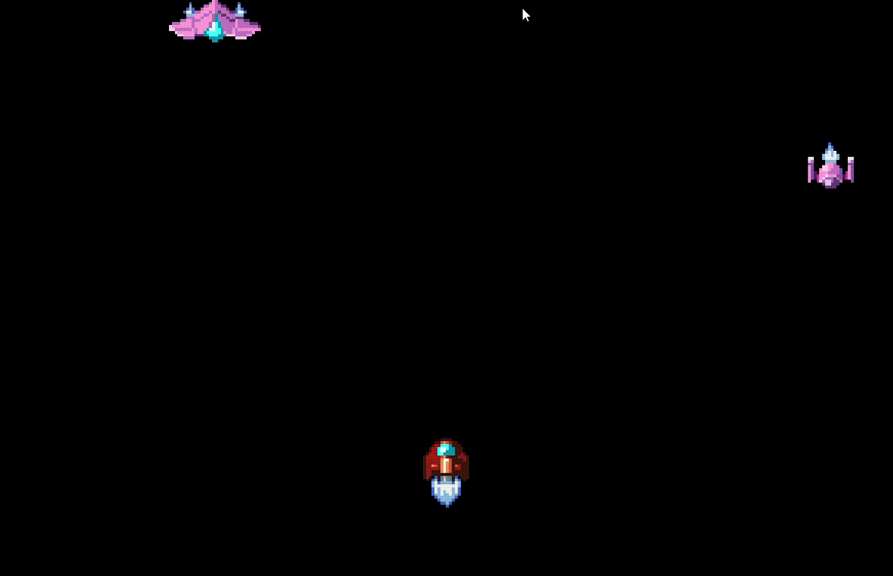

space-shooter.c
===============
A cross-platform, top-down 2D space shooter written in C using only platform libraries.

Dependencies
------------
- Base: Win32 (Windows), Xlib (Linux), Emscripten (Web)
- Rendering: OpenGL 3.3 (Windows/Linux), OpenGL ES 3.0 (Web)
- Audio: XAudio2 (Windows), ALSA/pthread (Linux), OpenAL (Web)
- Gamepad: XInput (Windows), evdev (Linux), Emscripten (Web)

Description
-----------
`space-shooter.c` is a cross-platform, top-down 2D space shooter written in standard C11 using only platform libraries (with platform libraries defined as anything included in the C standard library or supported platforms). `space-shooter.c` has been tested on Windows 10, Ubuntu Linux 16.04, Chrome 103 and Firefox 103. This project drew heavy inspiration from [Handmade Hero](https://handmadehero.org/) and [pacman.c](https://github.com/floooh/pacman.c).

The design and architecture of `space-shooter.c` is described [here](./ARCHITECTURE.md).

### Caveat
I am not a professional game developer, nor a professional C programmer, so the design may be unconventional or sub-optimal in many ways. Happy to take feedback from any pros out there!

Building
--------
Windows
- In a shell with [cl](https://docs.microsoft.com/en-us/cpp/build/building-on-the-command-line?view=msvc-160) set up, run `build.bat` for a debug build or `build.bat release` for an optimized build.
- Run `space-shooter.exe` from the `build/` directory.

Linux
- Make sure development headers for the Linux kernel, Xlib, glx and ALSA are installed.
    - E.g. on Ubuntu, run the following: `sudo apt install linux-libc-dev libx11-dev mesa-common-dev libasound2-dev`  
- Run `make linux-debug` for a debug build or `make linux-release` for an optimized build.
- Run `./space-shooter` from the `build/` directory.

Web
- Make sure [make](https://www.gnu.org/software/make/) and [emscripten](https://emscripten.org/) are installed.  
- Run `make web-debug` for a debug build or `make web-release` for an optimized build.
- Serve the `build/` directory from a local web server (e.g. `python -m SimpleHTTPServer`) and open the page in Chrome or Firefox.

What About Mac?
---------------
I hope to work on a Mac platform layer as soon as I have a Mac machine to work on.

Contributing
------------
Since this project is intended as a personal challenge, I am not accepting external contributions at this time. I am very open to feedback, however, so feel free to open an [issue](https://github.com/tsherif/space-shooter.c/issues) for anything that needs fixing.

Asset Credits
-------------
- Sprites: https://ansimuz.itch.io/spaceship-shooter-environment
- BG Music: https://chiphead64.itch.io/free-game-soundtrack-by-cactusdude-hurry-up
- SFX: https://fallenblood.itch.io/50-sfx
- Font: https://gpway.itch.io/white-pixel-sprite-font
